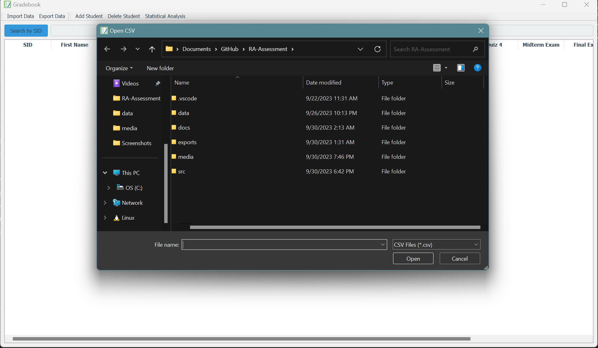
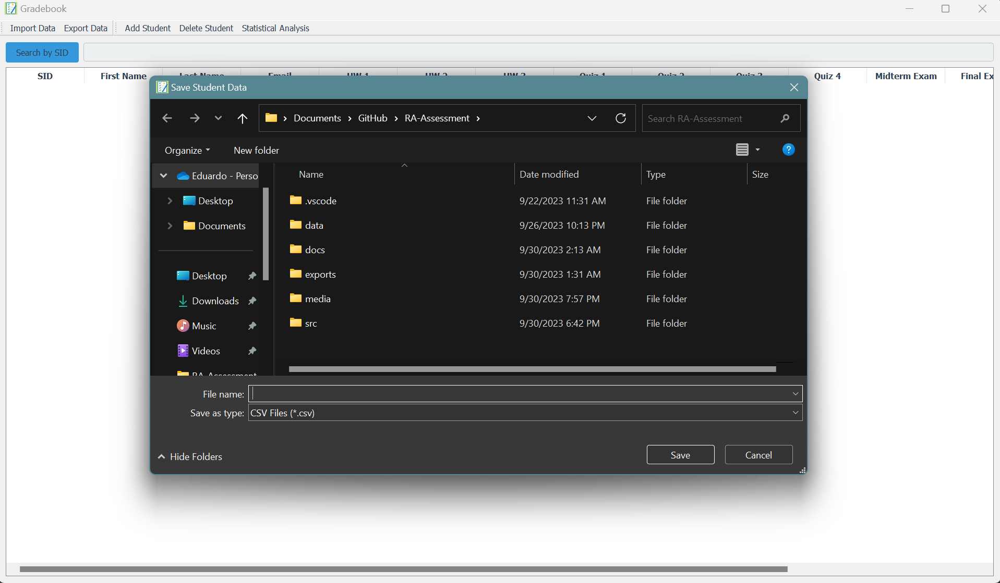
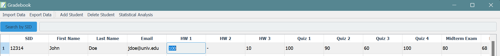
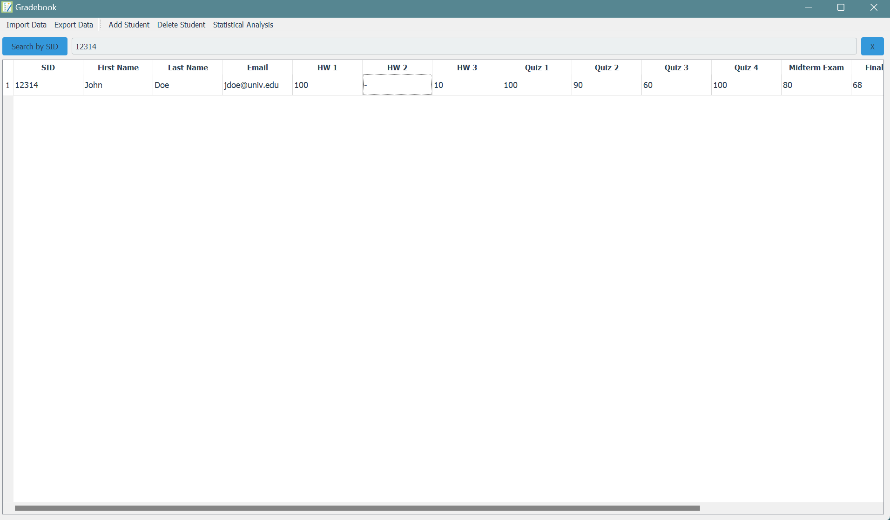
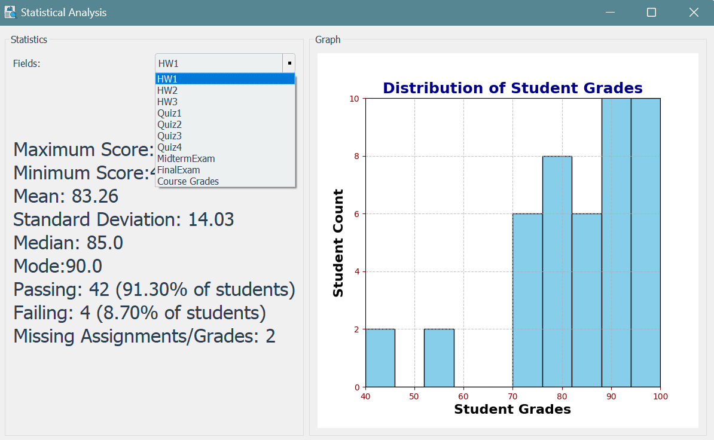
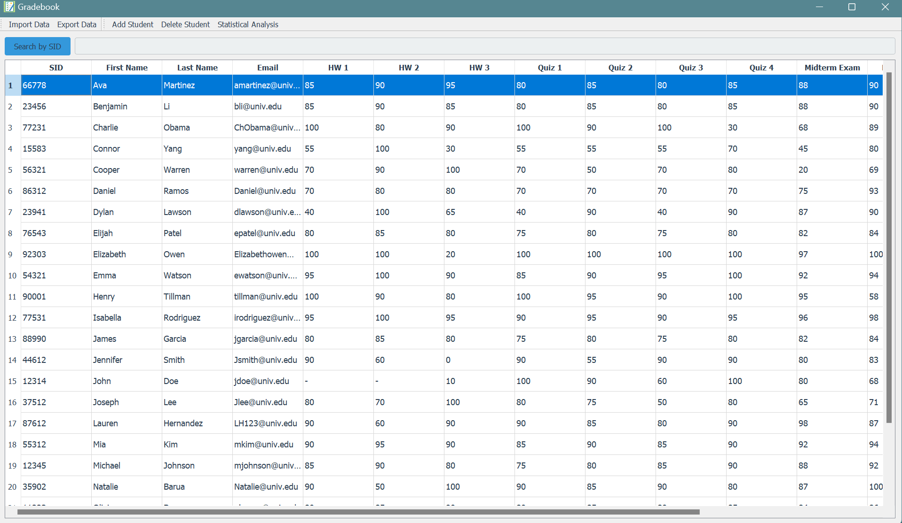
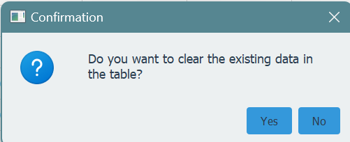

<div align="center">
    
    <h1>Gradebook Application 📘</h1>
    
    
    <a href="https://opensource.org/licenses/MIT">
        
    </a>
</div>

## Table of Contents
1. [Overview](#-overview)
2. [Features and Demo](#features-and-demo)
3. [Setting up the Development Environment](#%EF%B8%8F-setting-up-the-development-environment)
4. [License](#-license)


## 🌟 Overview

The Gradebook Application is a Python-based 🐍 software designed to assist educators in managing student grades efficiently. It aims to make the grading processes smooth, providing valuable insights into student and class performance through advanced data analysis. Please see documentation.md for more information regarding the implementation of the program.


## **Features and Demo** 

### Feature 1: Import Student Data
- **Description:** The user can import a csv file containing student data. 
    
    - **Screenshot:**
            
        

### Feature 2: Export Student Data
- **Description:** Users can export student data such as the modified grades and table, including the histogram shown in statistical analysis. The student data will be exported to a .csv file.
   
    - **Screenshot:**

        

### Feature 3: Add Student
- **Description:** User can add a student and populate the student's SID, First Name, Last Name, and email.
  
    - **Screenshot:**

        

### Feature 4: Delete Student
- **Description:** Users can delete a student from the table by click anywhere on the students row and pressing the "Delete Student" button.
    
    - **Screenshot:**

        

### Feature 5: Modify Student Data
- **Description:** A user can modify any students' grades on the table by double clicking the cell they want to change the grade of (user, assignment). Once the grade is changed a recalculation of the students final grade will be triggered. 

    - **Screenshot:** 
    
        

### Feature 6: Search for Students
- **Description:** Users can search for a student through their Student ID (SID) to view their current scores for all assignments. This will clear the table and keep only the searched for student. The user can revert the table and clear the search by clicking the "X" button.  

    - **Screenshot**

        


### Feature 7: Generate Statistics For Assignments, Exams, and Grades
- **Description:** User can generate an in-depth statistical analysis for each assignment, exam, and course grades held by the imported students. This analysis will contain the Minimum, Maximum, Average, Median, Mode, Standard Deviation, Passing Rate, Failing rate, and Missing Assignments. Passing and failing rates are based on whether the grade for the assignment, exam, or course is above or below 60%, respectively.
   
    - **Screenshot 1:**

        

    - **Screenshot 2::**

        

### Feature 8: User can Sort Columns 
- **Description:** Users can sort the columns on the table by clicking their labels. The first click of the column will sort it in descending order and a second click will sort the column in ascending order. 
    
    - **Screenshot:** 

        
    
### Feature 9:  User Can Clear Table 
- **Description:** Users can clear the table to upload a new CSV file, such as grades for a different class or a reformatted sheet, enhancing user-friendliness by eliminating the need to relaunch the program for grading different sections. This feature is triggered by clicking 'import' after populating the table. Upon selecting a file and clicking 'open', a popup will appear, prompting the user to clear the table.

    - **Screenshot:**

        


## 🛠️ Setting up the Development Environment

1. Install Python from [Python's official website](https://www.python.org/downloads/).

1. **Clone the Repository**: 
   - Use the command `git clone https://github.com/eddayyy/Gradebook-Application` to clone the repository.

2. **Install Requirements**:
   - Navigate to the project directory and run `pip install -r requirements.txt` to install necessary dependencies.

4. **Run the application**:
   ```
   python main.py
   ```


## 📜 License

This project is licensed under the MIT License - see [LICENSE.md](LICENSE.md) for details.
