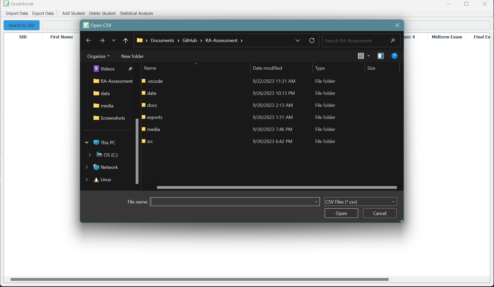
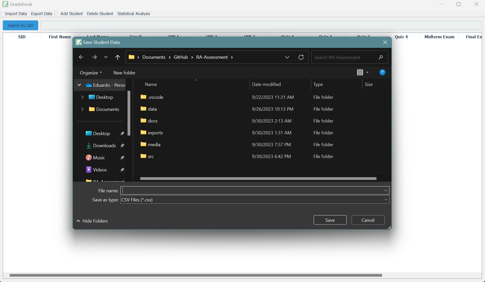
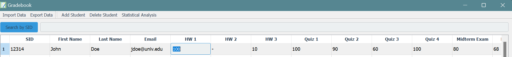
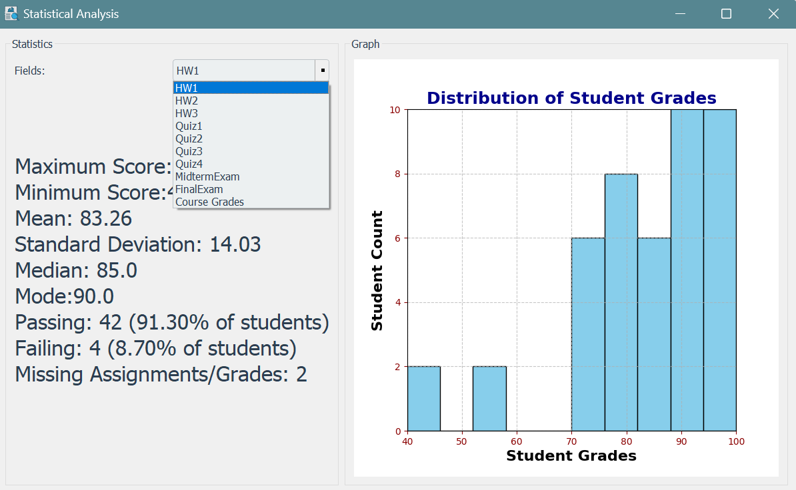

# Gradebook Documentation 

## Table of Contents
1. [Overview of Libraries Used](#Overview-of-libraries-used)   
2. [Library Usage Documentation](#Library-Usage-Documentation)
3. [Features and Demo](#Features-and-Demo)

## Overview of Libraries Used
This program utilized the following libraries: 
1. [PyQt5](#pyqt5)
2. [CSV](#csv)
3. [Sys](#sys)
4. [NumPy](#numpy)
5. [Matplotlib](#matplotlib)

# Library Usage Documentation

## [PyQt5](https://www.pythonguis.com/search/?q=PyQt5)
#### **Introduction** 

PyQt5 is a set of Python bindings for Qt libraries which can be used to create modern graphical user interfaces. PyQt5 was used extensively to create the Graphical User Interface. Throughout the codebase PyQt5 was crucial to creating the buttons, search feature, import/export feature, table display, graphical display, and the statistical analysis.
#### **Installation**

```shell
pip install PyQt5
```
#### **Modules Used**
In addition to rendering and formatting the GUI, PyQt5 also provided a robust table data structure that not only allowed student data to be displayed but modified, manipulated, replicated, and exported. This is thanks to PyQt5's QWidgets module. 

- The following documentation was used to implement PyQt5 to the Gradebook program:
1. [QTable Widget](https://doc.qt.io/qtforpython-6/PySide6/QtWidgets/QTableWidget.html#more)
    1. This was used to store the student data that the user imported. The documentation for that module is extensive and provides many useful methods for data manipulation. 
    2. The function setHorizontalHeaderLabels() was also used to label each column with the student info (SID, Name, Grades etc.).
    3. Another module used in combination with QTable Widget was QAbstractItemView. This was used in combination with the selection and editting behavior of the table. 
    4. There is also a connect feature which allowed for the interactions with the table to be connected to custom functions. An example of this is when the headers are clicked. This calls a function that I defined named sortColumns. This function allows the user to sort the students by SID, name, grades, etc.
2. [QAbstractItemView](https://doc.qt.io/qtforpython-6/PySide6/QtWidgets/QAbstractItemView.html)
    1. The particular functions that were used in this program are "QAbstractItemView.SelectRows()" and QAbstractItemView.DoubleClick()" these were used to dictate the selection and editing behavior of the table. 
3. [QApplication](https://doc.qt.io/qtforpython-6/PySide6/QtWidgets/QApplication.html)
    1. This clas was used to create an instance of Qt Application. This is necessary for any Python-based Qt Application. 
    2. Additionally the function .exec_() was used to begin the event loop for the Qt Application.
4. [Other QtWidgets used](https://doc.qt.io/qtforpython-6/PySide6/QtWidgets/)
    1. [QVBoxLayout](https://doc.qt.io/qtforpython-6/PySide6/QtWidgets/QTableWidget.html#PySide6.QtWidgets.PySide6.QtWidgets.QTableWidget.cellWidget)
        1. Used to set the vertical layout that was rendered. 
    2. [QToolBar](https://doc.qt.io/qtforpython-6/PySide6/QtWidgets/QToolBar.html#qtoolbar)
        1. Used to set the layout for the buttons such as "Add Student", "Import", "Delete Student".

 
## **[CSV](https://docs.python.org/3/library/csv.html)**

#### **Introduction** 

The CSV module in Python provides functionality to both read from and write to CSV files, managing tabular data such as a spreadsheet or database. In the Gradebook program, it is used to handle student data.

#### **Installation**

The CSV module comes pre-installed with Python, so there is no need to install it separately.

#### **Modules Used**

The CSV module is used to import and export student data, utilizing `csv.reader` and `csv.writer` classes for reading and writing to CSV files, respectively. This ensures smooth data management and sharing among users.


## **[Sys](https://docs.python.org/3/library/sys.html)**

#### **Introduction** 
The `sys` module in Python provides access to some variables used or maintained by the interpreter and to functions that interact strongly with the interpreter. It is a part of the standard library.

#### **Installation**
The `sys` module comes pre-installed with Python, so there is no need to install it separately.

#### **Modules Used**
The `sys` module is utilized in the main script to interact with the Python interpreter. Below is a breakdown of how the `sys` module is used in your main script:

- `sys.argv`: This is used to get the list of command line arguments passed to the script. In this case, it is passed to the `QtWidgets.QApplication` constructor to initialize the Qt application object.
- `sys.exit()`: This is used to exit the Python interpreter and the application when the Qt event loop ends.

## **[NumPy](https://numpy.org/doc/stable/)**

#### **Introduction** 

NumPy is a comprehensive library for large, multi-dimensional arrays and matrices, providing high-level mathematical functions to operate on these arrays. It is used for performing mathematical and logical operations on arrays.

#### **Installation**

```shell
pip install numpy
```

#### **Modules Used**

NumPy is used extensively in the Gradebook and StatisticalAnalysis classes for calculating statistics such as mean and standard deviation.

- The following functions were used to manipulate student data: 
1. [NumPy.mean()](https://numpy.org/doc/stable/reference/generated/numpy.mean.html)
    1. This function was used to calculate the mean for student grades. 
2. [NumPy.median()](https://numpy.org/doc/stable/reference/generated/numpy.std.html)
    1. This function was used to calculate the median in student grades. 
3. [NumPy.std()](https://numpy.org/doc/stable/reference/generated/numpy.median.html)
    1. This function was used to calculate the standard deviation of student grades.

## **[Matplotlib](https://matplotlib.org/stable/contents.html)**

#### **Introduction** 

Matplotlib is an extensive library that provides a plethera of plotting functions and customization. This was used to create a histogram that represented student data. 

#### **Installation**

```shell
pip install matplotlib
```

#### **Modules and Usage**

The Matplotlib library was used to provide the user with a visual representation of student data. I was able to embed the graph into the Qt application due to the FigureCanvasQtagg class. This allows the plots to be embedded into and interact with the Qt GUI Application.

- The following were used to create and embed the plot to the Qt Application
1. [Matplotlib.pyplotsubplots()](https://matplotlib.org/stable/api/_as_gen/matplotlib.pyplot.subplots.html)
    1. This function was used for the creation of the figure and subplots that were used in the application
2. [Matplotlib.FigureCanvasQTAgg()](https://www.pythonguis.com/tutorials/plotting-matplotlib/)
    1. This function was imported as `FigureCanvas` and was used to convert the figure into a Qt Drawable object so that could be embedded into the application.

## **[Features and Demo](https://github.com/eddayyy/RA-Assessment/tree/main)** 

### Feature 1: Import Student Data
- **Description:** The user can import a csv file containing student data. 
    
    - **Screenshot:**
            
        

### Feature 2: Export Student Data
- **Description:** Users can export student data such as the modified grades and table, including the histogram shown in statistical analysis. The student data will be exported to a .csv file.
   
    - **Screenshot:**

        

### Feature 3: Add Student
- **Description:** User can add a student and populate the student's SID, First Name, Last Name, and email.
  
    - **Screenshot:**

        

### Feature 4: Delete Student
- **Description:** Users can delete a student from the table by click anywhere on the students row and pressing the "Delete Student" button.
    
    - **Screenshot:**

        

### Feature 5: Modify Student Data
- **Description:** A user can modify any students' grades on the table by double clicking the cell they want to change the grade of (user, assignment). Once the grade is changed a recalculation of the students final grade will be triggered. 

    - **Screenshot:** 
    
        

### Feature 6: Search for Students
- **Description:** Users can search for a student through their Student ID (SID) to view their current scores for all assignments. This will clear the table and keep only the searched for student. The user can revert the table and clear the search by clicking the "X" button.  

    - **Screenshot**

        


### Feature 7: Generate Statistics For Assignments, Exams, and Grades
- **Description:** User can generate an in-depth statistical analysis for each assignment, exam, and course grades held by the imported students. This analysis will contain the Minimum, Maximum, Average, Median, Mode, Standard Deviation, Passing Rate, Failing rate, and Missing Assignments. Passing and failing rates are based on whether the grade for the assignment, exam, or course is above or below 60%, respectively.
   
    - **Screenshot 1:**

        

    - **Screenshot 2::**

        

### Feature 8: User can Sort Columns 
- **Description:** Users can sort the columns on the table by clicking their labels. The first click of the column will sort it in descending order and a second click will sort the column in ascending order. 
    
    - **Screenshot:** 

        
    
### Feature 9:  User Can Clear Table 
- **Description:** Users can clear the table to upload a new CSV file, such as grades for a different class or a reformatted sheet, enhancing user-friendliness by eliminating the need to relaunch the program for grading different sections. This feature is triggered by clicking 'import' after populating the table. Upon selecting a file and clicking 'open', a popup will appear, prompting the user to clear the table.

    - **Screenshot:**

        